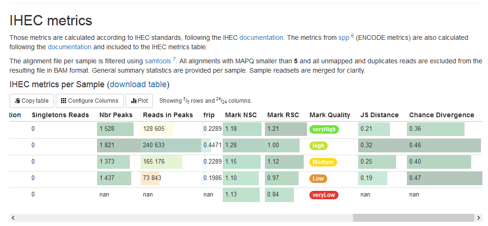

# C3G Sections 
`c3g_sections` use yaml passed into muliqc at runtime to configure each content, table or image. Content is rendered using the `c3g_content_renderer` module. Tables are rendered using the `c3g_table_renderer` module. Images can either be rendered using markdown in the `c3g_content_renderer` module or as separate images with the `c3g_image_renderer` module. To enable the `c3g_table_renderer` and `c3g_image_renderer` to recognize files the following search pattern code must be added to a yaml config file that is passed to multiqc at runtime.

```yaml
sp:
  c3g_image_renderer:
    fn_re: "png|jpeg|jpg"
  c3g_table_renderer:
    fn_re: "^.*.[t,c]sv$"
```
Each module including Multiqc modules are called in `module_order` in the yaml config file. Note that you can only have one `module_order` because Multiqc will only use the last `module_order`.

```yaml
module_order:
  - trimmomatic
  - homer
  - picard
  - c3g_image_renderer
  - c3g_content_renderer
  - samtools
  - c3g_table_renderer
```

----

## c3g_content_renderer
The content renderer is called in the `module_order` config option (see above for an example). It can be specified in either the same yaml file as `module_order` or in a separate yaml file. However, both yaml files must be passed to MultiQC at runtime. When specifying each content use the content `id` as the key name. An example is shown bellow.

```yaml
module_order:
    - c3g_content_renderer:
        id: UCSC_tracks # <-- id

UCSC_tracks: # <-- Key name
    id: UCSC_tracks # The module will work without
    # placing the id under the key name but it is here as a formality
    section_title: This is a section title
    parent_title: UCSC Tracks
    content: |
        Tab sensitive Markdown content that is converted into html by the module. Reference keys such as [[macs]], [[MACS]], [[HOmeR]], or [[trimmomatic]] can be added here. The reference module will find them and replace them with a user friendly link to the webpage of the tool. The reference will be automatically add to the bibliography.
```

Several other configurations are possible for content scetions. The `section_title` gives a name to the section, which can be described as the different contents rendered by one module. Therefore, in the above example `UCSC_tracks` is an example of a section. Once the `section_title` is set to a value, it is added to the table of contents on the left of the report. The `parent_title` config is only used when grouping multiple c3g sections together.


----

## c3g_image_renderer
The `c3g_image_rendeder` uses the Multiqc built-in file locator. To specify the image place the id in both the `module_order` under `c3g_image_renderer`. Then add a key name to a seperate yaml or the same yaml and specify the `image_path`. It is important to set the key for `working_dir` as well so that the module works correctly. `Section_title` and `parent_title` follow the same logic as before. The `caption` should apear at the bottom of the image. The `high_res_format` is used when the high resolution image is both in the same directiory and has the same name as the low resolution image.

```yaml
module_order:
    - c3g_image_renderer:
        id: Rad21_annotaion # <-- id

working_dir: report

Rad21_annotation: # <-- Key name
    id: Rad21_annotation
    section_title: Rad21 annotations
    parent_title: Rad21 Parent
    image_path: 
      - annotation/Rad21_image_peaks.png
    caption: Download full res image
    high_res_format: ps # <-- This is to specify the format of the high resolution image
```

The `c3g_image_renderer` encodes images with base64, which helps the webpage load at once without the images renderering after. It is important to note that base64 increases the load time of the page overall. Therefore, be cautious and selective with the amount and size of the images that are included in the report.

----

## c3g_table_renderer
The `c3g_table_renderer` takes csv or tsv files and plots them as MultiQC tables. To specify the table placement the id in both the `module_order` under `c3g_table_renderer`. Then add the key name to a separate yaml or the same yaml and specify the `table_path`. It is also important to set the key for the `working_dir` as well so that the module works correctly. 

`Section_title` and `parent_title` follow the same logic as before. The `table_title` adds a title over the table and also adds the link to download the table. The `content` is added above the table. Table_title specifies the title of the table and appears just above the table. `Header_descriptions` contains multiple keys and descriptions of those keys. Each key corresponds to a header in the table of intrest. `Header_adjustments` allows for the user to modify the formating and styling of each column separately. It uses similar syntax to that in the MultiQC documentation under the [plotting tables section](https://multiqc.info/docs/#creating-a-table) (See single_header, Multiqc docs).

Additionally, the the color scale can be changed for all tables, one table, and one collumn. To change the scale for all tables use `table_color_scale`. to change the scale for one table use `table_adjustments`. `Table_adjustments` can take [other adjustments](https://multiqc.info/docs/#creating-a-table) that are described in the by Multiqc documentation (See table_config, Multiqc docs). To change the color of one collumn add the `scale` variable to the `header_adjustments` of a collumn. The possible color scales are available in the [Multiqc docs](https://multiqc.info/docs/#table-colour-scales-1).

```yaml
module_order:
    - c3g_table_renderer:
        id: ihec_metrics
    - c3g_table_renderer:
        id: annotation

table_color_scale: 'BuGn'

ihec_metrics:
  id: ihec_metrics
  parent_title: IHEC metrics
  content: |
    Those metrics are calculated according to IHEC standards, following the IHEC [documentation](https://github.com/IHEC/ihec-assay-standards/tree/master/qc_metrics/chip-seq/script). The metrics from [[spp]] (ENCODE metrics) are also calculated following the [documentation](https://github.com/kundajelab/phantompeakqualtools) and included to the IHEC metrics table.

    The alignment file per sample is filtered using [[samtools]]. All alignments with MAPQ smaller than **5** and all unmapped and duplicates reads are excluded from the resulting file in BAM format.
    General summary statistics are provided per sample. Sample readsets are merged for clarity.

  table_title: IHEC metrics per Sample
  table_path:
    - IHEC_chipseq_metrics_AllSamples.tsv
  table_adjustments:
    - scale: 'PuOr'
  header_descriptions:
    Sample_Name: "Name of sample"
    Mark_Name: "Name of Histone mark"
    ChIP_type: "Type of peak called"
    Genome_Assembly: "Genome Assembly used for analysis"
    Raw_Reads: "Total Number of reads obtained from the sequencer"
    Trimmed_Reads: "Number of remaining reads after Trimming"
    Trimmed_Reads_Fraction: "100 x Trimmed_Reads / Raw_Reads"
    Mapped_Reads: "Number of Aligned reads to the reference after Trimming"
    Mapped_Reads_Fraction: "100 x Mapped_Reads / Trimmed_Reads"
    Duplicates_Reads: "Number of Duplicates reads ( aligned reads to the reference having the same 5' alignment positions for both mates in the case of paired-end reads)"
    Duplicates_Reads_Fraction: "100 x Duplicates_Reads / Mapped_Reads"
    Filtered_Reads: "Number of Aligned reads to the reference after filtering"
    Filtered_Reads_Fraction: "100 x Filtered_Reads / Trimmed_Reads"
    Mitochondrial_Reads: "Number of reads Aligned to either chromosome chrM or chromosome MT"
    Mitochondrial_Reads_Fraction: "100 x Mitochondrial_Reads / Filtered_Reads"
    Singletons_Reads: "Number of Singletons for Paired-End data sets"
    Nbr_Peaks: "Number of peaks called"
    Reads_in_Peaks: "Number of reads in peaks"
    frip: "Fraction of Reads In Peaks Reads_in_Peaks / Filtered_Reads"
    Mark_NSC: "Normalized Strand Cross-Correlation coefficient"
    Mark_RSC: "Relative Strand Cross-Correlation coefficient"
    Mark_Quality: "Quality Tag based on thresholded RSC coefficient"
    JS_Distance: "Jensen-Shannon distance (only if Input provided)"
    Chance_Divergence: "ChIP-Seq Analytics and Confidence Estimation (only if Input provided)"
  header_adjustments:
    Mark_Quality:
      - cond_formatting_rules:      
          veryHigh:
            - s_eq: 'very High'
            - s_eq: 'veryHigh'
          High:
            - s_eq: 'High'
            - s_eq: 'high'
          Medium:
            - s_eq: 'Medium'
            - s_eq: 'medium'
          Low:
            - s_eq: 'Low'
            - s_eq: 'low'
          veryLow:
            - s_eq: 'veryLow'
      - cond_formatting_colours: # Need to set the colors for the conditional formating to work
          - veryHigh: '#6fe339'
          - Low: '#e09436'
          - Medium: '#fcda14'
          - High: '#c1e036'
          - veryLow: '#e03936'
    frip:
      - format: '{:,.4f}'
      - suffix: ''
      - min: 0
      - max: 1
    Mark_NSC:
      - format: '{:,.2f}'
      - scale: 'RdYlGn'
    Mark_RSC:
      - format: '{:,.2f}'
    JS_Distance:
      - format: '{:,.2f}'
    Chance_Divergence:
      - format: '{:,.2f}'
    Reads_in_Peaks:
      - scale: 'RdYlGn'

annotations:
    header_adjustments:
        header_1:
            - adjustment_1:
                #...
            - adjustment_2:
                #...
        header_2:
            - adjustment_1:
                #...
            - adjustment_3:
                #...
```


The following images shows an exmple of each. 



----

## Reference Module
The reference module recognizes words or phrases enclosed in double square brackets (`[[Macs]]`). It replaces the reference key with an in-text citation and add the appropriate reference to the reference section. To initiate the reference module in other modules the `Reference` object must be called in that module. 

```python
>>> from multiqc_c3g.modules.references import references
>>> refobj = references.Reference(content)
>>> refobj.htmlcontent # This is the content with the replaced keys.
```

The `Reference` object makes a list of unique reference keys. When the reference module is called the reference keys from the modules are used to format a bibliography html section. The bibliography is added to the report when and where it is called in `module_order`.

```yaml
module_order:
    - c3g_content_renderer:
        id: content1
    - c3g_table_renderer:
        id: table1
    - references

content1:
    id: content1
    content: |
        This is where you may add as many reference keys as you want.
        [[homer]], [[igv]], and [[macs]] are bioinformatics tools.
table1:
    id: table1
    table_path:
      - your/relative/path.tsv
    content: |
        Tables can also take reference keys such as [[sambamba]], or [[trimmomatic]], or [[homer]].
```

The only config option for the references module is for changing the color of the highlight when the in-text reference number is selected.

```yaml
references:
    ref_target_color: '#0a8758'
```

Of note, one limitation is that the reference module cannot make a bibliography in any specific citaion style (ex. APA or MLA). See the source code docs for more technical details.

Thank you for reading this documentation. The code and documentation was done by Newton Martin. If there are any questions please reach out to Paul Stretenowich and Édouard Henrion from C3G.